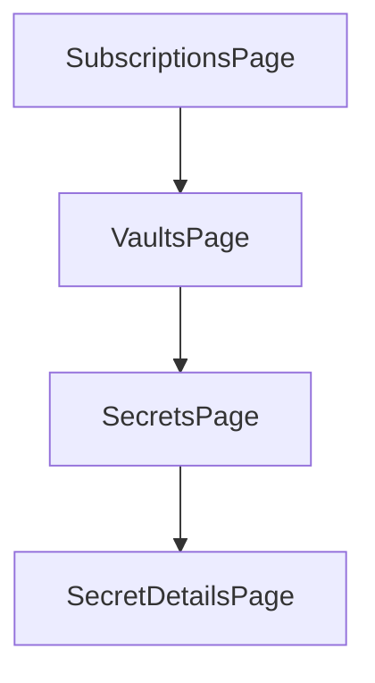

# Architecture

## Overview

The app is a single .NET MAUI project with a desktop-first Shell navigation flow.

It follows a simple MVVM structure:

- `Views` contain the XAML pages
- `ViewModels` own page state and commands
- `Services` wrap Azure CLI and Azure SDK access
- `Models` carry lightweight UI data

## Navigation Flow

## Service Responsibilities

### `AzureCliService`

- Checks whether Azure CLI is installed
- Checks whether an Azure CLI login session exists
- Lists subscriptions
- Sets the active subscription
- Lists Key Vault resources for the selected subscription

### `KeyVaultService`

- Creates `SecretClient` instances with `AzureCliCredential`
- Lists secret metadata
- Lists secret versions
- Loads a specific secret value

### `ExplorerState`

- Keeps the current subscription, vault, and secret selection in memory
- Lets pages navigate without passing large payloads through routes

## Authentication Model

The app intentionally relies on `az login` instead of embedding a custom Microsoft Entra sign-in flow.

Benefits:

- No client secret in the app
- Simple local developer experience
- Reuses existing Azure CLI sessions

Trade-offs:

- Azure CLI must be installed
- The app depends on local CLI session state
- Subscription discovery still uses CLI instead of ARM SDK

## Testing Strategy

The current tests focus on stable logic that does not need a running MAUI app:

- Azure CLI JSON parsing
- Search/filter helpers

This keeps the first test layer fast and platform-independent.
